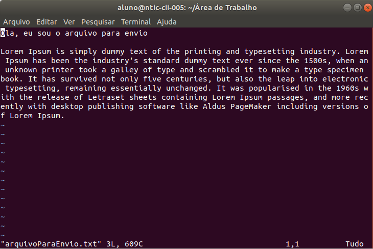
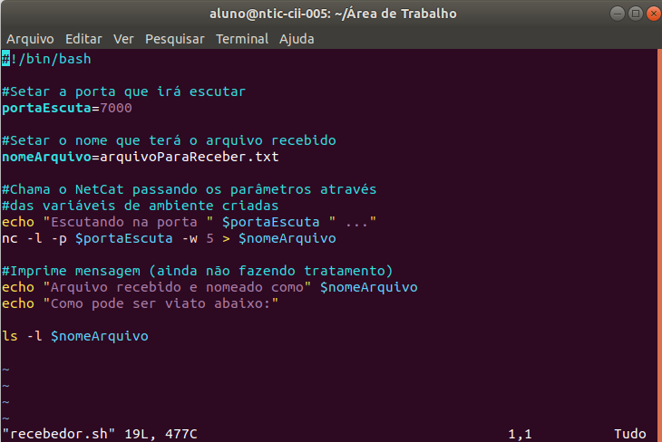
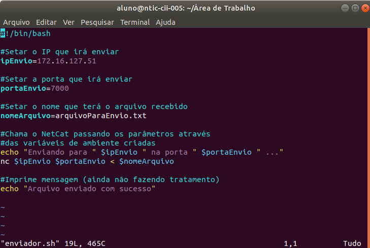
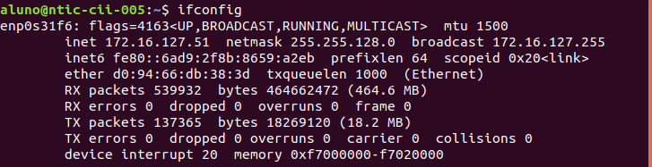
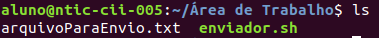
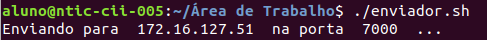
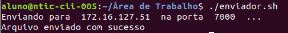
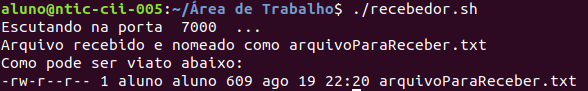
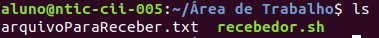
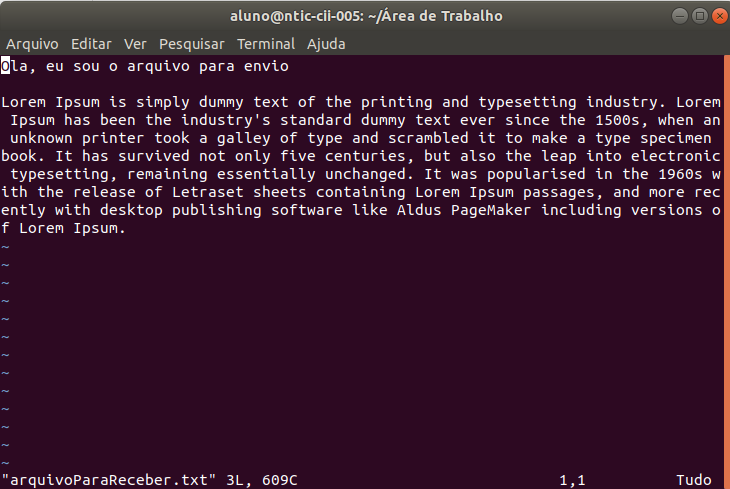

# Trabalho Pratico - Enviar arquivo de um PC para outro

O objetivo dessa trabalho consiste em basicamente enviar um arquivo de texto de um computador para outro. Para tal,
foi utilizado a linguagem ShellScript, devido a um sorteio feito em sala de aula.

Para isso, desenvolveu-se dois códigos, um que irá rodar na máquina onde o arquivo está, ou seja, na máquina que enviará o arquivo
e outro que irá rodar na máquina que receberá o arquivo, chamados carinhosamente de enviador e recebedor, respectivamente.

A base do funcionamento do trabalho executado é o *NetCat*, que trata-se de uma ferramenta de rede disponível para
os principais sistemas operacionais, porém, como utilizamos linux, o que irá nos interessar é o *NetCat* para linux.

## Arquivo a ser enviado

Foi gerado um arquivo para o envio, chamado *arquivoParaEnvio.txt* que foi gerado através de um *lorem Ipsum*, conforme pode ser visto na imagem abaixo:

## Recebedor

O código do recebedor é muito simples, através do *NetCat*, ele abre e mantêm "escutando" uma determinada porta do computador, para quando algum arquivo for enviado para essa porta, ele consiga recebê-lo e salvá-lo no computador.

O código utilizado segue abaixo: (A explicação do código está nos próprios comentários)

Utilizei variáveis de ambiente no linux para determinar os dois fatores cruciais para o devido funcionamento do código, que é porta que
irá ser escutada e o nome do arquivo que irá ser nomeado após recebimento. No exemplo da imagem, utilizamos a porta *7000* e o nome do arquivo que será recebido é *arquivoParaReceber.txt*.

Ao executar o script, temos o seguinte resultado:

Enquanto nao rodarmos o *Enviador*, nada a mais irá ocorrer.

## Enviador

O código do enviador é tão simples quanto o do Recebedor. O que ele faz é acessar a porta que foi aberta, também através do *NetCat*, e enviar um arquivo que lhe for passado, no caso, o arquivo *arquivoParaEnvio.txt*, conforme já foi mencionado.

O código utilizado segue abaixo: (A explicação do código está nos próprios comentários)

Para este código, conforme pode ser visto acima, também utilizei variáveis de ambiente, mas, neste caso, três valores são cruciais, sendo eles o IP que ele deverá conectar, a porta que deverá acessar e o arquivo que ele deverá enviar. Lembrando de prestar atenção no caminho do arquivo. 

Para saber o IP da máquina, basta rodar o comando *ifconfig* na máquina onde irá executar o *recebedor*, conforme imagem abaixo:(se analisar, o Ip de resposta do comando, é exatamente o mesmo que foi utilizado no código demonstrado)

Nos testes, foi utilizado o mesmo diretório para tudo, conforme pode ser visto através do comando *ls* :

Executando o enviador, temos o seguinte resultado no terminal:

Após essa mensagem, temos o *delay* de alguns milisegundos, e a seguinte mensagem aparece:

Diante disso, temos o término do envio, e conseguentemente, temos uma resposta na tela do *Recebedor*, conforme abaixo: (Lembrando que para rodar o *Enviador*, o *Recebedor* já deverá estar sendo executado, conforme tópico anterior)

## Resultado

Após esses passos, o *NetCat* já se responsabiliza por fechar as portas que foram abertas, e a comunicação finaliza. 
Enfim, temos o arquivo, com o nome que foi dado no *Recebedor*, no diretório onde ele foi executado, conforme abaixo:

Resta, agora, apenas confirmarmos se o arquivo recebido consiste com o arquivo enviado. Diante disso, segue abaixo o arquivo *arquivoParaReceber.txt*:

Se analisarmos o texto com o que foi mostrado em cima, pode-se comprovar que são idênticos.

